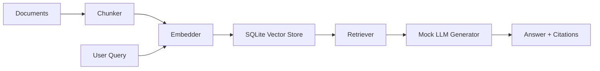

# SmartDocs AI Pro

SmartDocs AI Pro is an offline-first RAG project that demonstrates a full retrieval and generation pipeline with a lightweight embedding strategy built around the packages that are already available in the current environment.

## Highlights
- Offline ingestion from PDF, HTML, and Markdown files
- Deterministic chunking and SHA-based chunk IDs
- SQLite-backed vector storage using NumPy cosine similarity
- Mock grounded answer generation for demonstration and evaluation
- Small evaluation harness for retrieval and generation metrics

## Architecture


## Environment notes
The current environment already provides NumPy, pandas, Flask, Streamlit, and sqlite3. Packages such as scikit-learn, FastAPI, Plotly, ChromaDB, sentence-transformers, and FAISS are not installed, so the project uses a NumPy-based TF-IDF fallback and a custom SQLite vector store instead of heavier dependencies.

## Quick start
```bash
cd ml_projects/rag_project
python -m pip install numpy pandas flask streamlit
python backend/ingest.py
python backend/app.py
```

## Project structure
- backend/embeddings.py
- backend/vector_store.py
- backend/chunking.py
- backend/retriever.py
- backend/generator.py
- backend/ingest.py
- data/docs/
- data/vector_store.sqlite
